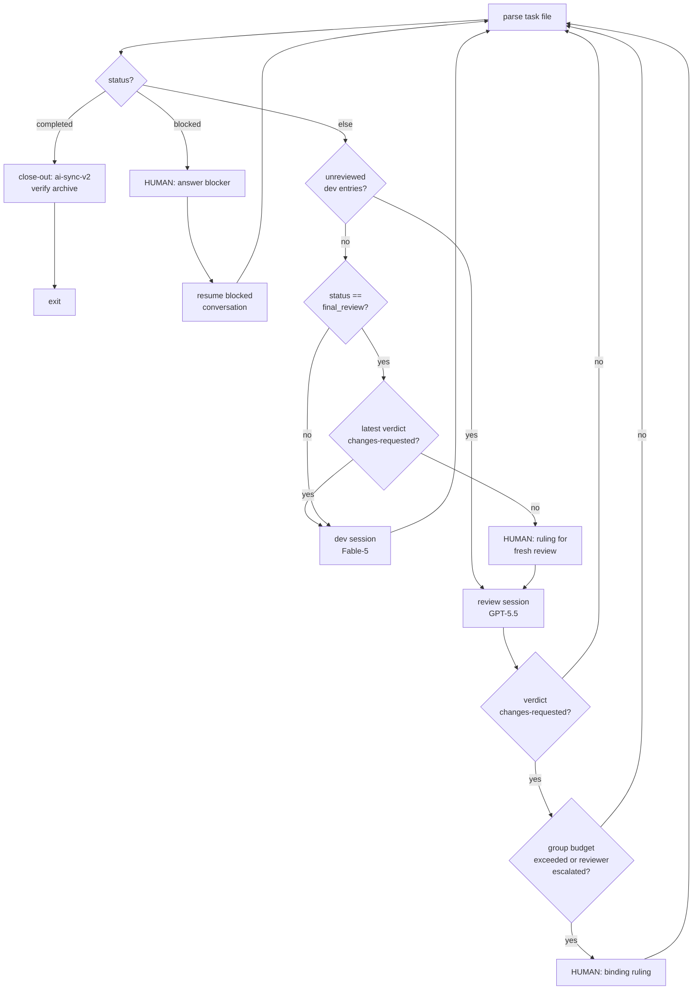

# Orchestrator operations manual

Runs the `dev → review → dev → …` loop over one `.ai-tasks/` task with a
different model per role. The orchestrator is a **dumb scheduler**: it reads
the task file (status + session log), dispatches the next session, verifies
protocol discipline afterwards, and pauses for a human on every decision it
is not allowed to make itself. All protocol semantics live in the shared
docs (`ai-coding-v2.md` §10/§11, `ai-coding-tasks-v2.md`,
`ai-coding-review-v2.md`); the orchestrator only counts and checks.

Everything in this directory is gitignored.

---

## 0. Execution backends (`--backend`)

The scheduler/state machine is backend-independent; only session execution
is pluggable:

| | `--backend cursor` (default) | `--backend cc-codex` |
|---|---|---|
| dev role | Cursor SDK agent, `claude-opus-4-8` | `--dev-agent claude` (default): Claude Code headless (`claude -p`), `claude-opus-4-8` @ `max` effort; `--dev-agent codex`: Codex CLI (`codex exec`), `gpt-5.5` @ `xhigh` effort |
| review role | Cursor SDK agent, `gpt-5.5` | Codex CLI (`codex exec`), `gpt-5.5` @ `xhigh` effort |
| auth | `CURSOR_API_KEY` (SDK; login not enough) | each selected CLI's own login (`claude` `/login` for the default dev agent, `codex login` for review and Codex dev) |
| subscription | Cursor only (cheapest) | Claude + OpenAI by default; OpenAI only when `--dev-agent codex` |
| protocol context | orchestrator injects it (SDK doesn't run hooks); `AI_ORCH=1` keeps `.cursor` hooks quiet | native: CC hooks + CLAUDE.md import chain, Codex `.codex` hooks (verified firing in `codex exec` and `claude -p`); no injection, no `AI_ORCH` |
| end discipline | orchestrator post-checks (sole enforcement) | each tool's Stop-hook chain + the same post-checks as backstop |
| session ids | SDK agent id | CC: uuid chosen by orchestrator (`--session-id`); Codex: captured from `thread.started`; both recorded in `logs/sessions.json` for resume routing |

## 1. Prerequisites

| Requirement | Why / how |
|---|---|
| `CURSOR_API_KEY` set (`cursor` backend only) | The SDK needs a real API key; `cursor-agent login` is NOT sufficient for the SDK. Put it in `.cursor/orchestrator/.env` (copy `.env.example`; loaded automatically at startup, file values win) — or export it (fallback when the file is missing or the key is empty there). |
| selected CLIs logged in (`cc-codex` backend only) | Default dev uses Claude Code, so `claude` must be logged in (check: `claude -p "hi"`); review and `--dev-agent codex` use Codex, so run `codex login`. |
| Clean working tree | Startup refuses otherwise (`working tree is not clean — resolve before orchestrating`). |
| A **real terminal** (tty) | Every escalation reads an answer from stdin. Running with `< /dev/null` EOF-crashes at the first `HUMAN INPUT NEEDED`. `--once` for a single non-interactive-ish session is usually safe but not guaranteed (a blocked session or request event still needs stdin). **Exception:** with `--control-dir` no tty is needed — escalations go through question/answer files (§5). |
| `.venv` in this directory | python3.14 + `cursor-sdk` (see `requirements.txt`; the SDK is optional for `cc-codex`). |

## 2. Invocation

```bash
cd /absolute/path/to/target-repo
# one-time runtime setup can be done by deployment:
#   aii-2 deploy --bootstrap-orchestrator /absolute/path/to/target-repo
# or manually: python3.14 -m venv .cursor/orchestrator/.venv && .cursor/orchestrator/.venv/bin/python -m pip install -r .cursor/orchestrator/requirements.txt
# edit .cursor/orchestrator/.env when using the cursor backend
.cursor/orchestrator/.venv/bin/python .cursor/orchestrator/orchestrator.py <task-id> [flags]
```

All `ORCH_*` variables and `CURSOR_API_KEY` are read from
`.cursor/orchestrator/.env` first, then from the exported environment.

| Flag / env | Default | Meaning |
|---|---|---|
| `<task-id>` | — | e.g. `2026-06-23-v1-risk-control` (file `.ai-tasks/<id>.md` must exist; trailing `.md` tolerated) |
| `--once` | off | run exactly ONE session (dev or review, whichever is due), then exit |
| `--backend` | `cursor` | `cursor` or `cc-codex` (see §0) |
| `--dev-agent` / `ORCH_CC_DEV_AGENT` (`cc-codex` only) | `claude` | `claude` = Claude Code headless for dev sessions; `codex` = Codex CLI for dev sessions. Review sessions remain Codex CLI. |
| `--plan-gate` | off | every dev session first proposes goal+plan and blocks for your confirmation before implementing (see §5.8) |
| `--dev-model` / `ORCH_DEV_MODEL` (cursor) / `ORCH_CC_MODEL` (`cc-codex --dev-agent claude`) / `ORCH_CODEX_DEV_MODEL` (`cc-codex --dev-agent codex`) | `claude-opus-4-8` (cursor/Claude dev) / `gpt-5.5` (Codex dev) | dev-role model, in the selected agent's own namespace (SDK wants **base** ids, not the `-thinking-high` variants `cursor-agent models` lists) |
| `--review-model` / `ORCH_REVIEW_MODEL` (cursor) / `ORCH_CODEX_MODEL` (cc-codex) | `gpt-5.5` | review-role model |
| `--dev-effort` / `ORCH_CURSOR_DEV_EFFORT` (cursor) / `ORCH_CC_EFFORT` (`cc-codex --dev-agent claude`) / `ORCH_CODEX_DEV_EFFORT` (`cc-codex --dev-agent codex`) | catalog default (= `high`) / `max` (Claude dev) / `xhigh` (Codex dev) | dev-role effort. cursor and Claude Code use the claude `effort` axis `low..max`; Codex dev uses the gpt/codex reasoning axis `none/minimal/low/medium/high/xhigh` |
| `--review-effort` / `ORCH_CURSOR_REVIEW_EFFORT` (cursor) / `ORCH_CODEX_EFFORT` (cc-codex) | catalog default (= `medium`) / `xhigh` | review-role effort: `none/low/medium/high/xhigh`. **Canonical spelling for the top tier is codex's `xhigh`** — the cursor gpt `reasoning` axis natively calls it `extra-high`, and the orchestrator translates per backend, so either spelling works anywhere (both tiers verified live) |

Effort values are validated at startup against a per-axis allowlist —
claude/fable axis: `low/medium/high/xhigh/max`; gpt/codex axis:
`none/minimal/low/medium/high/xhigh` (+ `extra-high` alias). The server
accepts unknown effort values **silently** and falls back to the default
effort (verified with a bogus value), so a typo would otherwise silently
downgrade the run; the orchestrator refuses instead.
| `ORCH_CODEX_SANDBOX` | `danger-full-access` | cc-codex only: codex `-s` sandbox mode. Full access by default (ruled 2026-07-04): `workspace-write` leaves `.git` READ-ONLY, so review-side ai-sync commits and close-out absorption fail (`git add` → `index.lock Operation not permitted`, verified live) |
| `--max-sessions` | 40 | safety budget per run; exit (resumable) when exhausted |
| `--control-dir` | unset | file-based control channel for an external supervisor (orch-hub): every escalation writes `NNN-question.json` into the dir and waits for `NNN-answer.json`; a `stop.flag` file stops the run at the next safe point (§5). Unset = interactive stdin, behavior unchanged |

Constants in the source: `MAX_FOLLOWUPS = 3` (post-check fix round-trips per
session), `GROUP_BUDGET = 2` (changes-requested re-reviews per convergence
group), `CONTEXT_BUDGET = 200000` tokens (or `ORCH_CONTEXT_BUDGET`) — the
per-session context ceiling, replicating `stop-context-check.sh`.

Note on cc-codex permissions: `claude -p` runs with
`--dangerously-skip-permissions` and codex with `danger-full-access` (both
overridable) — the safety gates are the protocol layer (automation-mode
blocking rules, authority tiers) plus the post-checks, not per-command
approval prompts or filesystem sandboxes.

## 3. How a turn is chosen (state machine)

Each loop iteration re-parses the task file from scratch — there is no
in-memory flow state. That means you can stop the orchestrator at any point
(Ctrl-C between sessions, `stop` at a prompt) and later restart it, or
interleave manual Claude Code / Codex / Cursor sessions: it re-derives the
turn from the file.

Decision order per iteration:

1. `status: completed` → **close-out** (ai-sync-v2 via the review agent), then exit.
2. `status: blocked` → **surface the blocker to you**, resume the blocked
   conversation with your answer (see §5.4).
3. Any dev session-log entry not yet named by a `review of <sid>` entry
   → **review turn** (one review session covers the whole pending set).
4. `status: final_review` with nothing pending → the last review didn't
   conclude; **ask you for a ruling**, then dispatch a fresh review with it.
5. Otherwise (`in_progress`/`pending`, nothing awaiting review) → **dev turn**.



Typical full cycle: dev advances scope (`in_progress`) → review of that
session (changes-requested, interim) → dev **remediation session** (fixes
valid findings / disputes invalid ones — never advances new scope and never
touches status, per the status-transition table in `ai-coding-tasks-v2.md`
§3) → review re-checks the group → pass → dev advances the next scope chunk
→ … → dev sets `final_review` → final gate reviews the WHOLE findings
ledger → pass → `completed` → close-out. A final gate that cannot pass
keeps `final_review` and the loop dispatches dev remediation; it reverts to
`in_progress` only if `final_review` was set in error (task not actually
dev-complete).

## 4. What one session looks like

Each protocol session = one **fresh** conversation on the backend (fresh
context; resume is used only for blocked sessions, post-check followups,
and close-out). The first prompt is assembled by the orchestrator:

- protocol block — `cursor` backend only: generated by piping
  `{"conversation_id": <agent-id>}` into `.cursor/hooks/session-start.sh`
  (with `AI_ORCH` stripped for that one call). The `cc-codex` backend skips
  this — CC's CLAUDE.md import chain / hooks and Codex's hooks load the
  protocol natively (verified: both fire headless);
- `automation-mode.md` — headless rules: never ask inline, block via
  `status: blocked` instead; self-enforce §10 End (clean tree, session-log
  entry, role-legal status);
- role invocation line (`task <id>` / `review <id>`); review prompts also
  inline the full `ai-coding-review-v2.md`;
- an **ENTRY CHECKLIST** instantiated with this session's concrete values
  (claimed-by id@timestamp; dev: `session-est: 1/3 → 2/3` and
  `pending → in_progress` when applicable; review: the pending review set
  at dispatch, and a no-est reminder);
- dev advancement prompts include the protocol's **preReEst** step: compare
  overall Scope/Acceptance, any `## Session plan`, and the latest Next/Open;
  split only current/future unimplemented slices if the current slice is too
  large; then work one clear slice and optionally log `Plan-slice: <slice>`.
  Remediation prompts explicitly skip preReEst and may log
  `Plan-slice: remediation for review group <sid>`;
- a **POST-SESSION CHECKS** preview — rendered from the SAME spec table
  `post_checks` executes afterwards (single-sourced, so prompt and checker
  cannot drift). The status line of the preview is the per-session-kind
  menu from the tasks-v2 §3 transition table, instantiated with the entry
  status (advancement / remediation / interim / final gate).

The **conversation id is the session id** — it's what appears in
`### <date> / <session-id> / …` log entries and in `claimed-by`. For CC the
orchestrator picks the uuid itself (`--session-id`) so the first prompt can
name it; Codex assigns its own on the first event and the orchestrator
tells the agent to use the id from its session-start context.

After the agent ends, the orchestrator replays the Stop-hook checks:

1. clean tree (`git status --porcelain` empty);
2. a `## Session log` entry exists for this session id;
3. status legal for the role (dev: `in_progress|final_review|blocked`,
   never `completed`; review: strict transition table keyed by the status
   found at entry);
4. review entries additionally need `Verdict:` and `Group:` lines;
5. dev sessions must have incremented `session-est` `<current>` (part of
   the §10 claim; review sessions don't consume the estimate);
6. a remediation session (latest review verdict was changes-requested at
   entry) must not have changed `status` at all.

Violations are sent back **into the same conversation** to fix — up to 3
followups, then it escalates to you.

**Context budget** (port of the interactive Stop hook's
`stop-context-check.sh`): after every turn the orchestrator estimates the
conversation size — cursor backend: full conversation JSON / 4 chars per
token; claude: the per-request usage of the latest MAIN-thread assistant
event (input + cache reads/creation + output; subagent events and the
`result` event's usage are ignored — the latter is CUMULATIVE across the
run's requests and overcounts by orders of magnitude); codex: the session
rollout transcript's chars / 4 (`$CODEX_HOME/sessions/…/rollout-*-<thread-
id>.jsonl`, the same approximation codex's own Stop hook applies; file not
found → estimate unavailable → budget check skipped). Every `run finished`
log line carries `context≈N tokens` (both backends; live cc-codex values
run tens-of-k — 46k–87k observed across the 2026-07-04 drills). Over
`CONTEXT_BUDGET` (200k default):

- post-checks clean → the session simply takes no further turns (any
  remaining work lands in a fresh session — the loop re-derives the turn);
- post-checks failing → the followup becomes a **wrap-up instruction**
  (clean tree, session-log handoff entry, no new work). For dev advancement
  with a `## Session plan`, the wrap-up prompt asks the agent to split the
  remaining current slice into one-session-sized continuation work, preferably
  by adding a slice like `session-2-cont` instead of renumbering later slices.
  If wrap-up still fails after `MAX_FOLLOWUPS`, you're asked to fix manually.

**One dev session = one reviewable unit** (§10): an ADVANCEMENT session's
landed work is reviewed before the next dev session advances, no matter
why the session ended (planned convergence or context overage) — its
wrap-up is an ordinary clean handoff and never writes a continuation
marker (post-checked). The `- Handoff: continuation` marker is
**remediation-only**: a remediation session that wraps before its fix set
is complete marks its entry, and the loop dispatches a fresh DEV
(remediation) session instead of a re-review; re-review waits until the
fix set completes (latest entry without the marker). A marker on a
non-remediation entry is ignored with a WARNING. Review-side continuation
needs no marker: a review that wraps mid-set leaves sids pending, so the
next turn is a review anyway (one review entry per pending sid — a sid
named only in prose stays pending).

Escalation prompts are hardened: every `HUMAN INPUT NEEDED` banner is also
written to the log file (auditable afterwards), stale buffered stdin lines
are drained before reading (a stray Enter pressed during an hour-long run
can no longer silently answer a blocker), and empty answers are re-prompted.

## 5. Human interactions (all of them)

Every escalation looks the same on the terminal:

```
========================================================================
HUMAN INPUT NEEDED
========================================================================
<banner explaining the situation>
(discussion-capable escalations also show the opt-in reply hint)
(type your answer; 'stop' aborts the orchestrator)
answer>
```

`stop` always aborts the whole orchestrator cleanly (tree is clean between
sessions, so a later restart just re-derives the turn). A **plain answer is
binding exactly as before**. When the escalation has a live or resumable
agent session, an answer beginning with `?`, `？`, or `discuss:`
(case-insensitive) is instead a discussion turn: the marker is stripped and
the rest is sent into that escalation's own session under a strict read-only
instruction. The agent's reply is surfaced as a new `HUMAN INPUT NEEDED`
question, and the loop repeats until you give a plain binding answer. The
banner advertises this option only when discussion is available.

Every discussion round is an ordinary question/answer pair. Under
`--control-dir`, it therefore gets a new sequence number and retains the
original escalation `kind`; no hub-specific protocol or discussion kind is
needed. If a no-session escalation receives a marker anyway, the orchestrator
re-asks with `Discussion not available on this escalation` instead of
recording the marker text as a ruling. `plan-gate` is deliberately unchanged:
its existing confirmation loop already sends every non-confirm answer back to
the planning session, so marker-looking text there remains ordinary plan
feedback.

With `--control-dir DIR` the same escalations flow through files instead of
stdin (for an external supervisor such as orch-hub; no tty needed):

- Each escalation atomically writes `NNN-question.json` — `{seq, ts, kind,
  banner, message}` (`message` = `banner` for now; `kind` names the
  escalation per §5.1–5.8: `request | run-error | followups-exhausted |
  blocked | convergence-budget | dispute-unresolved | final-review-stall |
  closeout-incomplete | plan-gate`) — then polls for `NNN-answer.json`
  once a second. Only a non-empty string `answer` is required of the answer
  file (`seq`/`ts`/`responder` are optional extras); a malformed or partial
  file is logged and re-read each tick, never silently swallowed.
  `"answer": "stop"` behaves exactly like typing `stop`.
- A `stop.flag` file in the dir stops the run gracefully at the next
  session boundary (logged, exit code 0). While a question is pending it
  aborts the wait like a `stop` answer (nonzero exit). The orchestrator
  never deletes the flag — use a fresh run dir per run. Numbering continues
  after any stale `NNN-*` files in a reused dir; they are never overwritten
  or consumed.
- Keep the dir OUTSIDE the repo working tree (an in-repo dir would dirty
  the tree and fail post-checks; startup warns). The banner still goes to
  the run log in both modes, and `human answered:` is logged identically.

### 5.1 Request event (agent tried to ask interactively)

`automation-mode.md` forbids inline questions; if an agent still emits a
`request` (awaiting input/approval), the orchestrator cancels the run and
asks you. Your answer is sent into the same conversation with an instruction
to continue headless. This is a backstop — reaching it at all means the
agent ignored the automation rules.

Marked discussion turns ask that same paused conversation for clarification
without letting it continue work.

### 5.2 Run errored mid-flight

The run started, then failed (SDK/infra error). You're asked for an
instruction; it is sent into the same conversation as a retry prompt.
Startup failures (agent never ran) are different: those exit the
orchestrator immediately with the error.

The errored conversation remains available for marked clarification rounds
before the retry instruction.

### 5.3 Post-checks still failing after 3 followups

The agent couldn't (or wouldn't) satisfy clean-tree / session-log / status
after 3 fix round-trips. You're shown the violation list; your answer is
forwarded verbatim as `[orchestrator] Human instruction: …` and the
followup counter resets. Useful answers: a concrete fix instruction, or
`stop` and fix by hand.

Marked turns discuss the violations with the same live session first.

### 5.4 Blocked task (`status: blocked`)

The agent hit a Confirm-tier change, load-bearing uncertainty, or a
disputed finding, and blocked per automation-mode. You're shown
`blockers:` plus the `Open` section of the latest log entry. Your answer is
sent via `Agent.resume` into the ORIGINAL conversation (full context
preserved), with instructions to restore the pre-blocked status (the left
side of `→ blocked` in its entry heading), clear `blockers`, and continue.
The resume uses the blocked session's own role — any session may block per
the §3 table (e.g. a reviewer escalating its round budget), so a blocked
reviewer resumes as review and is post-checked against the review
transitions for the status it entered with.

A marked answer resumes the original conversation for a read-only
clarification turn only. Its reply becomes a new `blocked` question; the task
file, status, session log, and working tree must remain untouched. A later
plain answer is then sent through the normal unblock prompt above. On the
plain-answer common path, the session is still resumed only after the answer,
as before.

**Caveat**: this works when the configured backend can resume the id in
`claimed-by` (including cc-codex sessions recorded in `sessions.json`). If a
*manual Claude Code / Codex* session left a foreign id, resume may fail; the
orchestrator exits with guidance. Unblock manually first (answer the blocker
in that tool, or edit the task file), then restart the orchestrator.

### 5.5 Convergence budget exhausted / dispute

After a `changes-requested` review, the orchestrator counts
changes-requested entries sharing the same `Group:` anchor. If the count
exceeds `GROUP_BUDGET` (2), you're shown the latest findings and asked for a
**binding ruling**. The ruling is injected into the NEXT dev prompt as
`HUMAN RULING (binding for this session): …`. (A final-gate rejection
keeping `final_review` is the NORMAL handback per the transition table —
not an escalation signal.)

**Unresolved disputes skip the budget**: when a dev session disputed a
finding and the re-review still holds it valid, the reviewer writes a
`Dispute-unresolved: …` line in its entry (per `ai-coding-review-v2.md`);
the orchestrator pauses on that marker immediately — a two-sided
disagreement is escalated on round 1, not looped until the budget runs
out. Same banner mechanics (`DISPUTE UNRESOLVED`), same binding-ruling
injection.

Marked clarification turns resume the reviewer session that produced the
budget exhaustion or unresolved-dispute entry. The eventual plain answer —
not the discussion text — is the binding ruling injected into the next dev
session.

**Caveat**: the pending ruling lives in memory only. If you `stop` here and
restart later, the next dev session dispatches WITHOUT re-asking; the
budget re-escalates only after the next failed review. If that matters,
keep the ruling in your answer to the next escalation, or note it in the
task file yourself before restarting.

### 5.6 final_review stall

Everything is reviewed, status sits at `final_review`, and the latest
review did NOT conclude with `changes-requested` (which would dispatch dev
remediation) — i.e. the last review died without a verdict-driven handback.
A dumb scheduler doesn't loop on this: you're asked for a ruling, which is
appended to a fresh review session's prompt.

When the latest review entry identifies a resumable reviewer session, marked
answers may clarify with that session first. If no such session exists, a
marker gets the standard discussion-not-available re-ask.

### 5.7 Close-out incomplete

After `completed`, the review agent is resumed to run `/ai-sync-v2`
(absorb + archive). The orchestrator verifies: task file gone from
`.ai-tasks/`, archive copy exists, index row removed, no active task still
lists an archived task id in `blockers`, no `blocked` task has empty blockers,
the close-out response includes `Remaining-task audit: ...`, and the tree is
clean. Up to 3 followups; if still incomplete you're asked to finish manually
and type `done`.

cc-codex usually never reaches this path: a final-gate pass trips the
review session's own Stop hook, which forces `/ai-sync-v2` INSIDE that
session (verified live 2026-07-04, incl. correct admission rejection of
non-absorbable content). The orchestrator recognizes the already-archived
task — it skips post-checks for that session, verifies archive/index/tree plus
remaining-task reconciliation evidence/invariants, logs `close-out done
(performed in-session by the native hook chain)`, and exits. The same
recognition covers a RESUMED blocked reviewer that
concludes pass → completed (handle_blocked; verified live 2026-07-04 —
previously a crash). §5.7 remains the cursor-backend path and the
backstop.

The normal close-out path keeps its review session live while asking, and the
native-close-out verifier resumes the responsible reviewer when its id is
known, so both support marked clarification rounds. A verifier with no known
session uses the standard no-session re-ask.

### 5.8 Plan confirmation (`--plan-gate`)

With the flag on, every formal dev advancement session is preceded by a
separate **read-only shadow planning session**. Remediation sessions after a
`changes-requested` review skip this gate because the review findings already
define the repair plan. The planning session uses the upcoming dev session's
perspective to report what it learned and what it plans to do, but must not
execute the normal entry checklist, claim the task, change
`session-est`/status, append a session-log entry, edit files, run tests/builds,
start services, install dependencies, or generate artifacts. It may do bounded
read-only discovery: read the task/session log, frontmatter `prefetch:` docs,
and a small number of directly relevant source/test files; run short read-only
inspection commands such as `rg`, `sed`, `ls`, `git show`, and
`git diff --name-only`. It then replies with fixed headings:
`Goal / Acceptance`, `Confirmed Facts`,
`Assumptions / Unknowns`, `Work Approach`, `Verification Strategy`, and
`Risks / Likely Failure Points`; empty sections say `None identified`. The
`Work Approach` section should be concise and name key files/modules only when
they materially clarify the plan, not as a complete file-by-file checklist.

The loop revolves around that reply as a **plan-report artifact**: everything
from the `## Goal / Acceptance` line to the end of the reply is captured as
plan-report rev 1. Each further round has exactly three possible outcomes:

- **Revised** — the session restates the COMPLETE report (optionally a short
  change summary first, then `## Goal / Acceptance` onward, unchanged sections
  kept verbatim). The restated report replaces the current one wholesale and
  the banner shows it as the next rev. Any new fact, constraint, or decision
  the discussion produced must be folded into the report, because only the
  report is ever delivered.
- **Unchanged** — a purely clarifying answer ends with the exact line
  `PLAN-REPORT: unchanged`. The banner shows the answer plus a pointer
  (“still rev N from round M”) instead of re-attaching the report.
- **Neither shape** (warn-and-keep) — the banner shows the reply with a
  WARNING that the current rev is kept and is what `confirm` delivers. (A
  first reply carrying no `## Goal / Acceptance` heading at all is adopted
  wholesale as rev 1, with a warning — there is nothing older to keep.)

Banners are capped at 12,000 characters; every round's full reply — and, on
confirmation, the delivered report — goes to the orchestrator log in full.
Reply with `confirm` (or an explicit approval such as `approve`, `proceed`,
`确认`) to authorize implementation of the CURRENT plan-report; any other
answer is treated as feedback and sent back into the SAME planning session.
This repeats until you confirm or type `stop`. Once confirmed, the
orchestrator closes the planning session, starts a fresh formal dev session,
and injects only the approved plan-report and the human ruling into the formal
dev prompt — never the last turn's raw text, never conversation history. That
formal session then runs the normal entry checklist, owns the real session id,
and ends with the normal single session-log entry. If a planning turn dirties
the tree anyway, the banner warns you (consider `stop`).

If the orchestrator dies between plan and confirmation, nothing was
persisted — a restart simply proposes a fresh plan (stateless turn
detection sees an ordinary dev turn).

Without the flag, dev sessions start implementing immediately (the §7
authority tiers still escalate Confirm-tier changes via the ordinary
blocked path). The gate catches direction errors; the tiers catch
change-level risk — they are complementary.

## 6. Attaching to an in-flight task

Fully supported — turn detection is stateless (§3). Mappings:

| Task state at attach | First action |
|---|---|
| latest entry = dev entry marked `Handoff: continuation` (+ latest verdict changes-requested) | dev remediation turn (fix set still open; re-review deferred). Marker without an open remediation → ignored with a WARNING, normal dispatch |
| dev entries unreviewed (any tool made them) | review turn (reviewer needs only task file + git, no transcript) |
| all reviewed, `in_progress` (e.g. after a changes-requested review) | dev turn — dev verifies findings, fixes valid ones (correctness first), records disputes |
| `final_review` + unreviewed dev entries | review turn (final gate) |
| `final_review`, all reviewed, latest verdict changes-requested | dev remediation turn (status stays `final_review`) |
| `final_review`, all reviewed, no verdict-driven handback | ruling prompt (§5.6) |
| `blocked` (by a previous orchestrator run) | blocker prompt → resume (§5.4) |
| `blocked` (by a manual session) | **crashes — unblock manually first** (§5.4 caveat) |
| `completed` | close-out with a fresh review-model session |

Group budgets are continuous across attach: counting re-scans ALL review
entries in the file, including pre-orchestrator ones.

## 7. Logs and monitoring

- Per-run log: `logs/<utc-ts>-<task-id>.log` — state lines, session
  start/end, post-check violations, convergence counts, human answers, and
  the assistant text of every run (`--- <agent-id> ---` blocks).
- The terminal shows status-level lines only (session start/end, violations,
  escalations). The log file additionally carries a **live event stream** —
  `tail -f` it to watch liveness:
  - `[tool] <name> <args…>` — each tool call as it starts (`[tool-error]`
    on failure; completions are not logged);
  - `[gen] text +234 chars, thinking +4.1k chars (28 events / 30s)` —
    high-rate text/thinking char events aggregate into one line per 30s
    window (`GEN_WINDOW`); the window flushes early BEFORE any immediate
    line ([tool]/[status]/…, so the file reads in stream order) and at run
    end. Full assistant text still lands in the `--- <agent-id> ---`
    transcript block after the run;
  - `[thinking] <n>s` — duration-carrying thinking blocks (per-block, low
    rate) stay immediate; codex reasoning items log as `[thinking] block`;
    claude's `system/thinking_tokens` events (one per ~1.5s of thinking,
    237 observed in one session) collapse to ONE `[status] thinking_tokens
    (burst …)` line per burst — any other event ends the burst;
  - `[status] …` — SDK status events;
  - `[heartbeat] still running: <n>s since last stream event` — written
    after every 30s of stream silence (`HEARTBEAT_SILENCE`). Events flowing
    = working; heartbeats accumulating for many minutes = likely hung (or a
    very long generation — judge by the last `[tool]`/`[gen]` line).
- The task file itself is the ground truth for progress.

## 8. Testing / maintenance

- `test_loop_mock.py` — offline mock-loop tests (no network, temp repo),
  29 scenarios: loop mechanics (review dispatch, followups, budgets,
  blocked resume — dev and review roles, foreign-sid guidance exit,
  close-out plain / native / native-incomplete / native-on-blocked-resume,
  final_review stall), prompt instantiation, context-budget wrap-ups (both
  session kinds), event-stream logging, CLI argv shapes + sessions.json
  resume routing, and the `--control-dir` file channel (question/answer
  files, malformed/stale handling, stop.flag, same-kind escalation
  discussion rounds, no-session marker rejection, and unchanged plan-gate
  feedback semantics). Run after ANY orchestrator change:
  `.venv/bin/python test_loop_mock.py` (needs to run outside a sandbox; it
  shells out to git).
- `smoke_hooks.py` — one-off empirical checks of hook behavior under the
  SDK (kept for reference).
- Hooks: both `.cursor/hooks/*.sh` no-op when `AI_ORCH=1` (exported by the
  orchestrator; SDK sessions inherit it). Interactive sessions are
  unaffected.

## 9. Known limitations

- Without `--control-dir`, escalation is stdin-only: no tty → EOF-crash at
  the first prompt (`--control-dir` IS the file-based answer drop, §5).
- Pending ruling not persisted across restarts (§5.5 caveat).
- Blocked-by-foreign-session exits with guidance instead of resuming
  (§5.4 caveat); on `cc-codex`, resume routing relies on
  `logs/sessions.json` — a sid missing there falls back to
  role→configured-tool guessing with a logged warning.
- Single task per run; no multi-task queue.
- Codex TUI hook firing is unverified (`codex exec` verified; also
  irrelevant to the `cursor` backend — SDK sessions bypass hooks).
- VERIFIED live 2026-07-04 (drill fixtures): CC SessionStart + Stop hooks
  fire under `-p` and decide correctly against an active task; codex
  SessionStart + Stop hooks fire under `codex exec` (incl. the
  status=completed → ai-sync block, and re-injection with `source=resume`
  on `codex exec resume`); `claude --resume` (blocked dev session answered
  → same conversation continues, single transcript file); `codex exec
  resume` (blocked final-gate reviewer answered → same thread concludes).
  NOTE: codex 0.142.5 REJECTS `-s` on the `exec resume` subcommand
  ("unexpected argument") — the resume argv carries the sandbox as
  `-c sandbox_mode=…` instead (and no `-m`: the thread keeps its model).
  No `request`-event equivalent exists for CLIs (an agent waiting for
  input would look like a hang — watch the heartbeat).
- codex `--json` emits no reasoning items at any effort (observability gap
  — `[thinking] block` lines never appear for codex; same class as the CC
  thinking-block skip).
- cc-codex JSONL schemas are version-sensitive (parsers written against
  claude 2.1.196 / codex 0.142.5; unknown events degrade to `[status]` /
  `[raw]` log lines, never crash).
